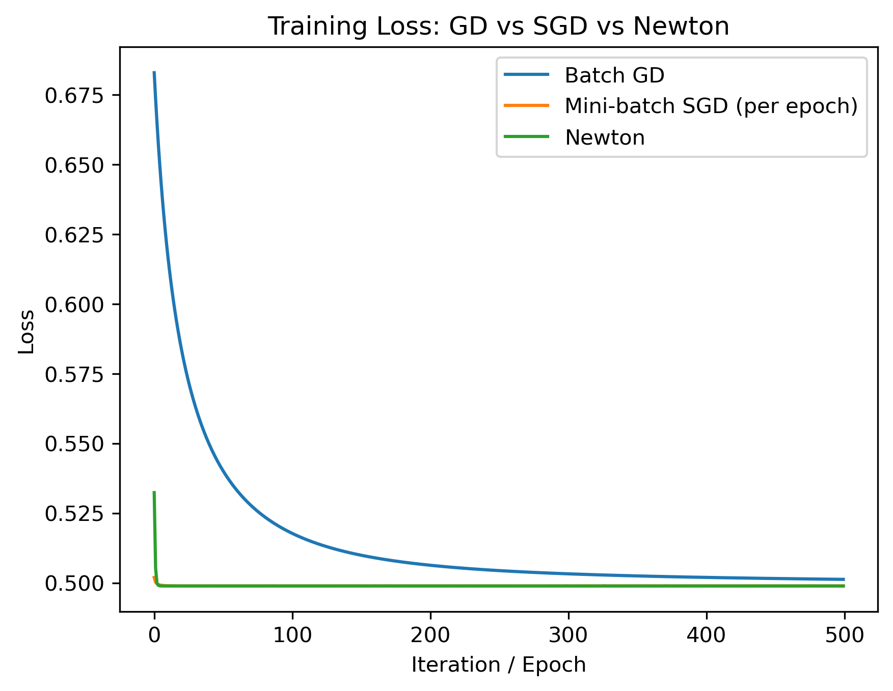
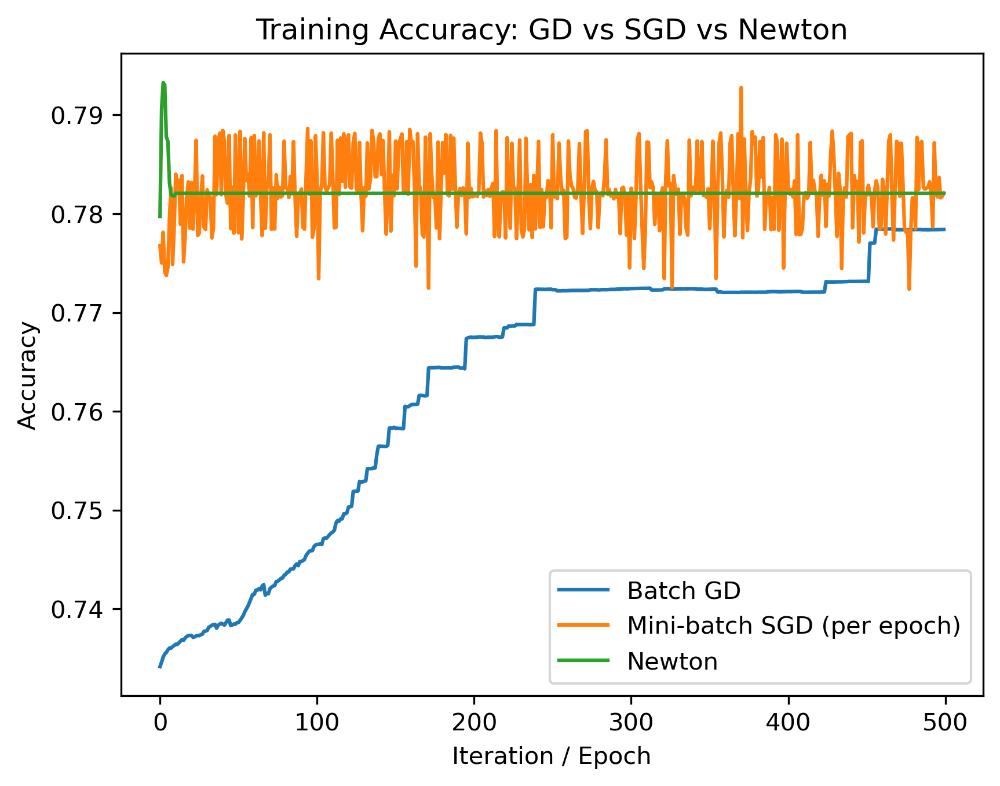

# MATH 320 Final Project

Names: Seth Hillis, Germán Gutiérrez Erives, Jessica Reyes

## Outline

### Sigmoid Function for Logistic Regression

$$\sigma(z) = \frac{1}{1 + e^{-z}}$$

### Logistic Loss (Negative Log-Likelihood)

For logistic regression with L2 regularization, the objective function is:

$$f(x) = -\sum_{i=1}^{n}\left[ b_i \log(p_i) * (1 - b_i)\log(1 - p_i) \right] * \frac{\lambda}{2} \lVert x \rVert^2,$$

where

$$p_i = \sigma(a_i^\top x).$$

---

## Algorithms

We applied Batch Gradient Descent, Mini-batch Stochastic Gradient Descent, and Newton’s Method to minimize the logistic loss function.

The logistic loss is a convex function, which guarantees that all three optimization methods converge to the global minimizer. Our dataset is also well-structured for binary classification with labels 0 and 1, making logistic regression appropriate.

We compare the methods by examining:

* Convergence rates
* Stability of updates
* Final training accuracy

All methods use the same loss, gradient, and (for Newton’s Method) Hessian formulas for fair comparison.

---

## Results

  
  

Our experiments show that Mini-batch SGD and Newton’s Method converge significantly faster than Batch Gradient Descent. Both reach higher training accuracy overall, with Newton’s Method achieving the most stable updates.

Newton’s Method converges in very few iterations due to its use of curvature information from the Hessian. Mini-batch SGD takes more steps but still converges far faster than Batch GD.

Batch Gradient Descent converges slowly and requires many more updates to reach a comparable solution.

---

## Discussion

While both Newton’s Method and Mini-batch SGD produced strong convergence and accuracy, their computational behavior differs:

* Mini-batch SGD scales efficiently to very large datasets and high-dimensional models.
* Newton’s Method is extremely fast on small or medium datasets but becomes expensive when feature dimensionality grows due to Hessian computation.
* Batch Gradient Descent is simple but inefficient for large-scale problems.

If we extended our feature set to include raw URL text (e.g., TF–IDF vectors with thousands of dimensions), Newton’s Method would become impractical. In that setting, Mini-batch SGD would likely be the best method.

---

## Conclusion

For this dataset, Newton’s Method proved to be the most effective algorithm:

* It achieved the highest accuracy.
* It converged faster than Batch Gradient Descent.
* It was more stable and consistent than Mini-batch SGD, which oscillated around the minimum as expected.

Mini-batch SGD performed well and converged quickly but exhibited the characteristic noisy updates. Batch Gradient Descent converged the slowest.

Overall, Newton’s Method delivered the strongest performance for our logistic regression model given the feature set and dataset size.

---

